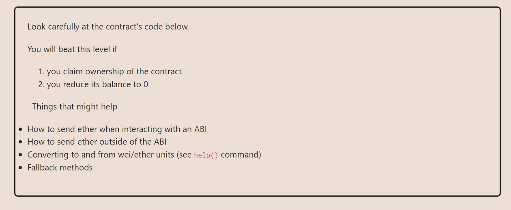
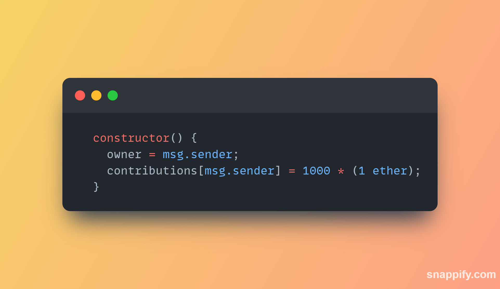
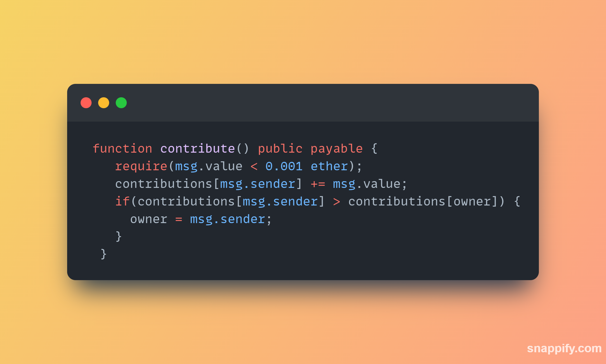
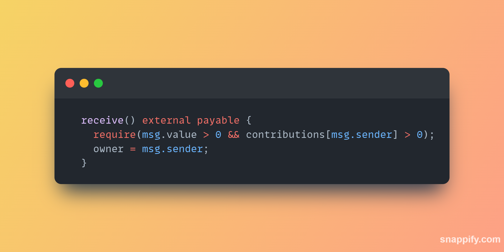

**OBJECTIVES ARE PRETTY CLEAR**

1. An attacker should be the owner of the smart contract that was not deployed by them
2. Withdraw everything from the smart contract i.e balance = 0.

**THE APPROACH I USED:**
I went for sections of the code where the owner of the smart contract is updates to "message.sender" i.e owner = msg.sender;
1. In the constructor().
Nothing much to be done here, It's all initialization

2. In the contribute().
Here we see a condtion:-
The **`msg.sender`** here is the Attacker, He will only become the `owner` when he has some amount of contribution that's not 0 that's greater than that of the `legit owner`.
i.e `contributions[msg.sender] > contributions[owner]` 

3. In the receive()
The `receive()` is a variant of the `fallback()`.
The `receive()` will be called when the `msg.data` is empty and the `receive()` exists.
In this case it exists in the smart contract and we will leave the msg.data empty and `transact`
