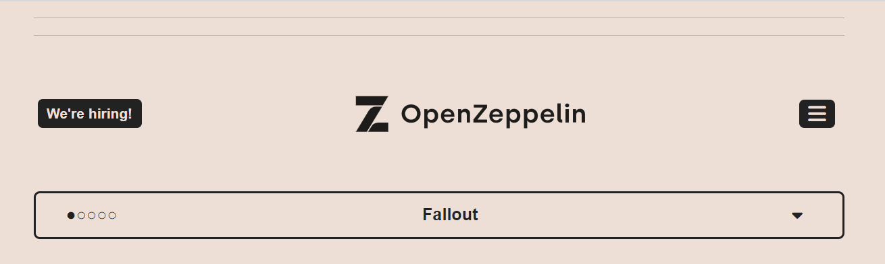
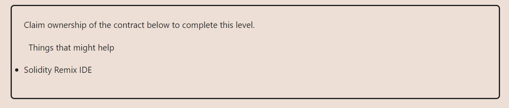
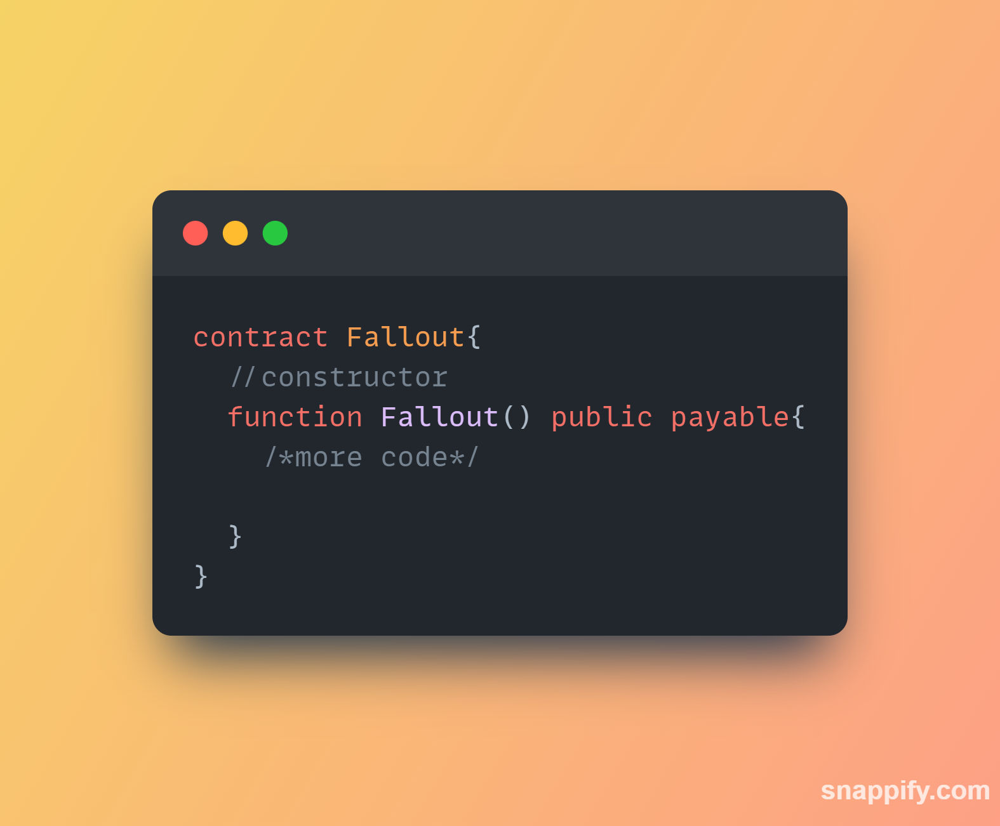
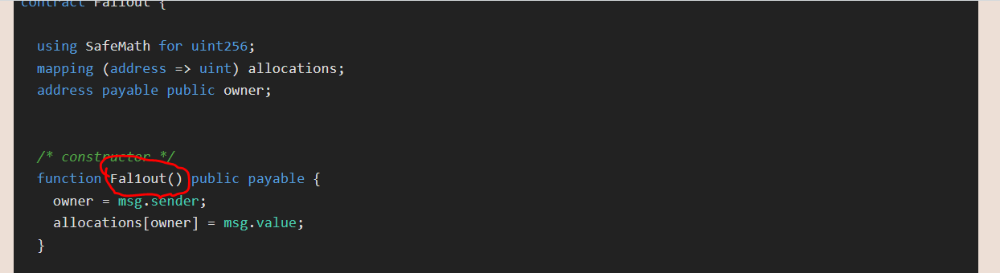

**LEVEL NAME**

**OBECTIVE**

WHERE DOES THE TRICK LIE?

We assume the programmer of this contract made and error in naming their constructor(),

That is for `solidity v0.6.*` the constructor definition is as below:-

LOOKING AT THE SMART CONTRACT WE NOTICE THIS:

this is `Fal1out` different from the contract name `Fallout` 
thus it is not a constructior so just calling the `fal1out()` will make the deployer the owner of this smart contract

**FINALLY**

use an interface to interact with the `Fallout` contract.
First call the `Fal1out()` then check the `owner`

    // SPDX-License-Identifier: MIT
    pragma solidity ^0.8.0;
    interface Fallout {
        function owner() external view returns (address);
        function Fal1out() external payable;
    }

`

