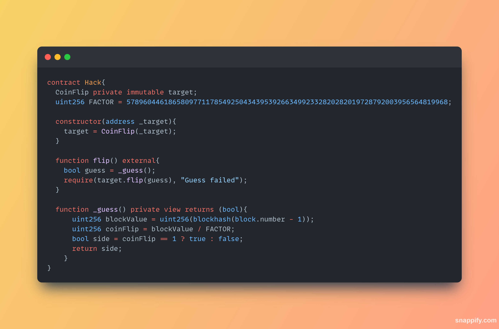

Key lessons
1. Calling another contract from another contract

WHERE THE ACTUAL CHALLENGE LIES

1. we will make an attacker contract that is going to be calling the `flip()` in the 
10 times as per the requirement.

then we can call the `flip()` in the Hack contract 10 times.
