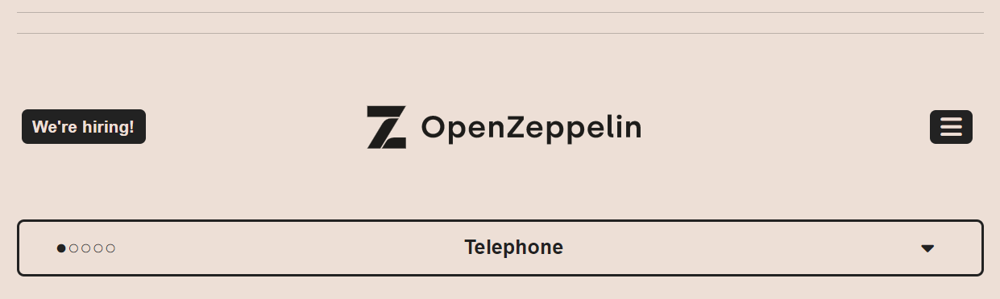
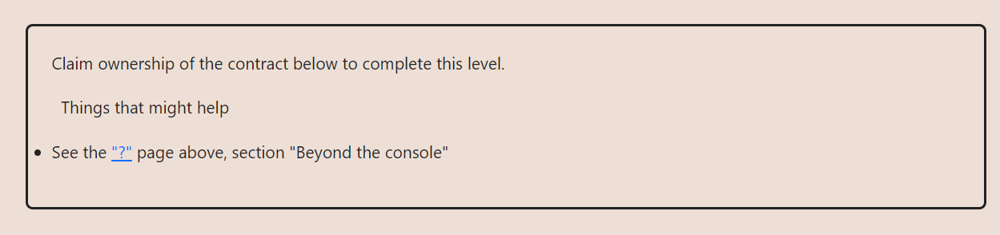
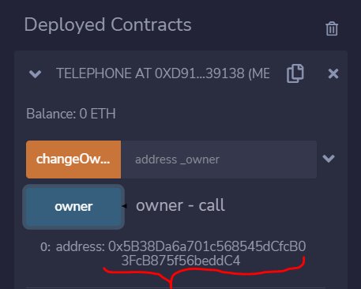
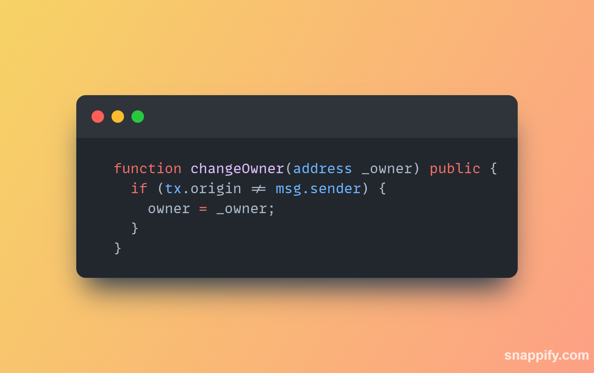
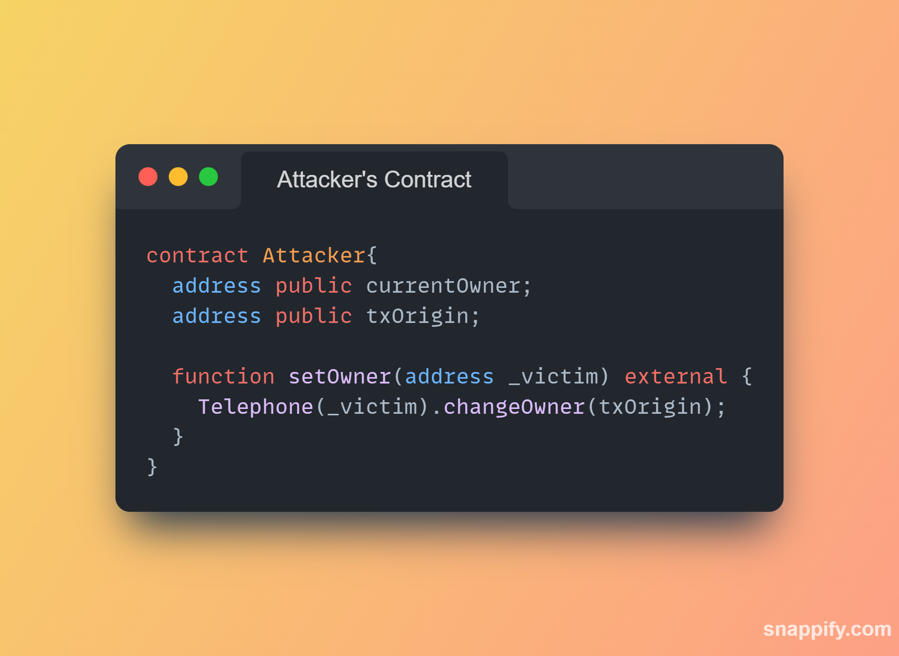
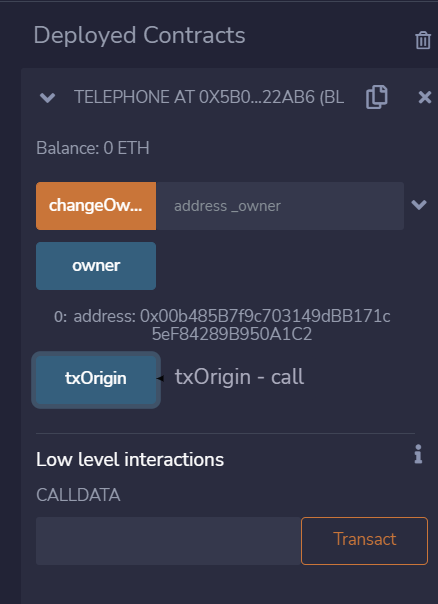

**TASK AT HAND**

**TO PASS THIS CHALLENGE YOU NEED TO**

THE APPROACH I USED
First, Assume that the attacker's address is 
0xAb8483F64d9C6d1EcF9b849Ae677dD3315835cb2`
when the owner of this contract becomes the 
attacker the challenge is passed.

CURRENT OWNER:

checking the places where the `_owner` is 
set to `owner` we see this part of `changeOwner()`

``
if (tx.origin != msg.sender){
    //set the owner to _owner
}
``

**WHAT IS `tx.origin`?**

tx. origin is a global variable in Solidity 
which returns the address of the account that 
sent the transaction. _**Using the variable for 
authorization could make a contract vulnerable 
if an authorized account calls into a malicious contract.**_

With msg.sender the owner can be a contract.

With tx.origin the owner can never be a contract.

In a simple call chain A->B->C->D, 
inside D msg.sender will be C, and tx.origin will be A.

so what i will do i try changing owner by calling `Telephone` from an attacker contract 

FINAL RESULTS

this means the code in the `if()` can now run thus setting the `owner` to `_owner`