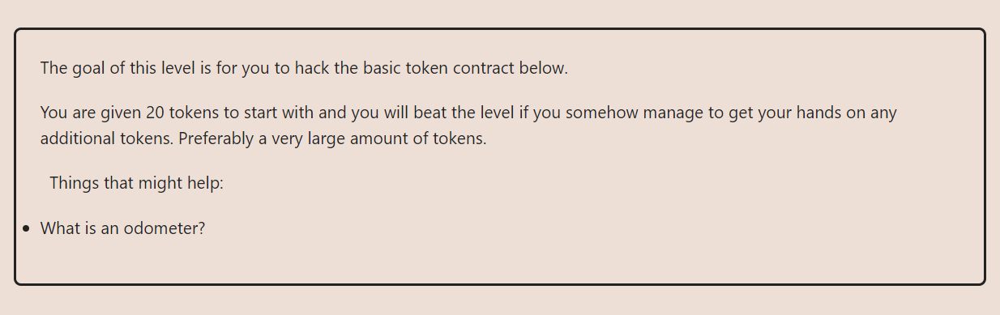

**LEVEL-04: token**

**TASK AT HAND**

**THE APPROACH I USED:**

We will be the Attackers i.e the `attacker contract`, So the `victim contract` is the instance that will be provided to us by `ethernaut`.

i.e For my case: 

**ALL WE NEED TO DO IS CREATE AN ATTACKER CONTRACT**

This `Attacker` contract will call the `Token` contract, Within the token contract will call the `transfer()` function
then we will send ourselves something like `10 tokens`.

**WHY CAN'T WE CALL IT DIRECTLY?**

The `transfer()` function in the `Token` contract has some conditions that are limiting that particular approach

**FINALLY SUBMIT THE INSTANCE**

