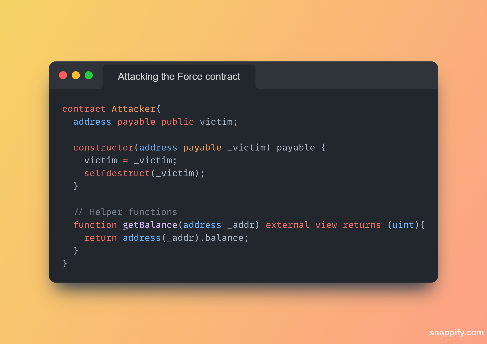
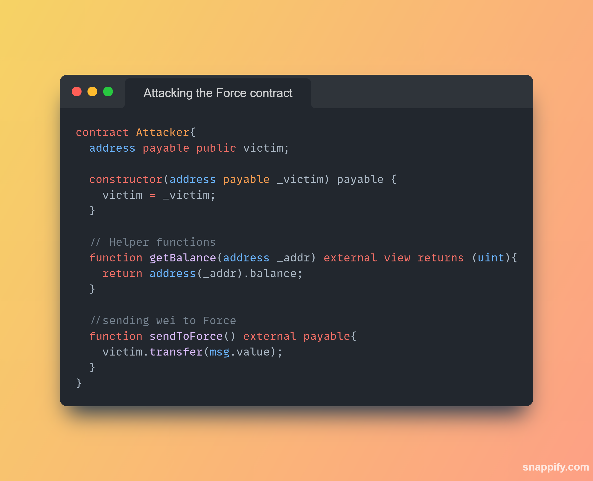
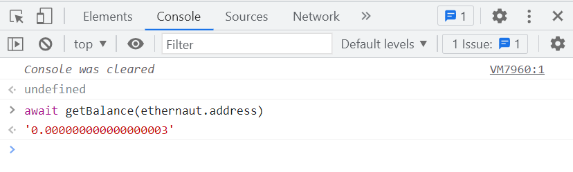

**LEVEL 07: FORCE**

**TASK AT HAND**

**CHECKING THE BALANCE OF THE FORCE CONTRACT**

**FROM THE "THINGS THAT MIGHT HELP"**,

They suggested that the best way to beat this challenge is;

THE APPROACH I USED;

I went with the option to attack the smart contract and tried some low level calls but that was not possible because interactions with the `Force contract` at a low level required that the `fallback()` and `receive()` were declared in the contract.

AFTER CALLING THE ATTACKER CONTRACT;

Call the `sendToForce()` function with let's say `3 wei` as `msg.value`. Check the balance of the `Force` contract address.
