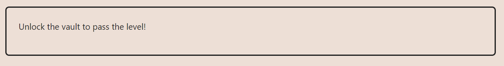
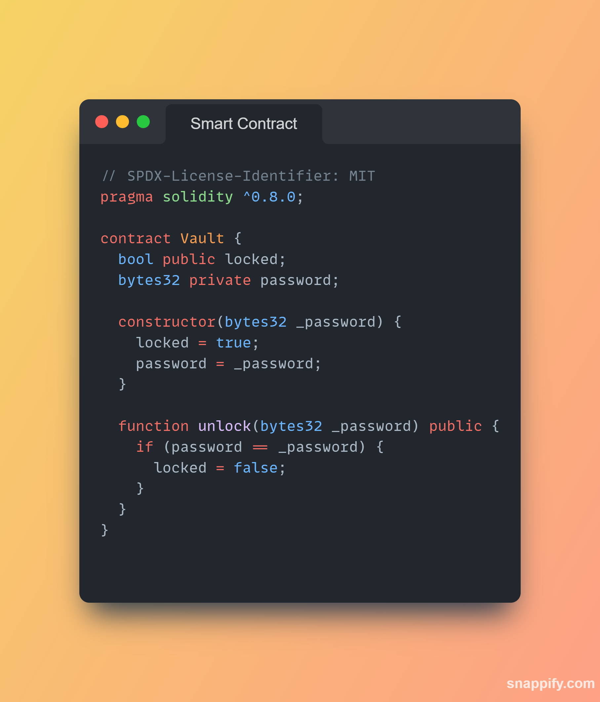

**LEVEL 08: VAULT**

**TASK AT HAND**

[//]: # (MY APPROACH)
**THE APPROACH I USED**

The password is set to private and that does not mean we can not access it.

So we will use the console.

There is the `bytes32 passworrd`

