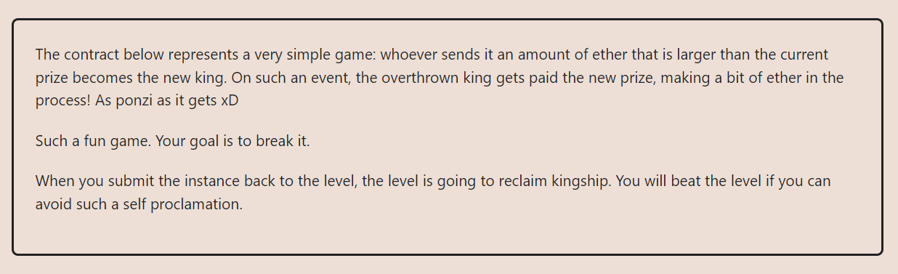
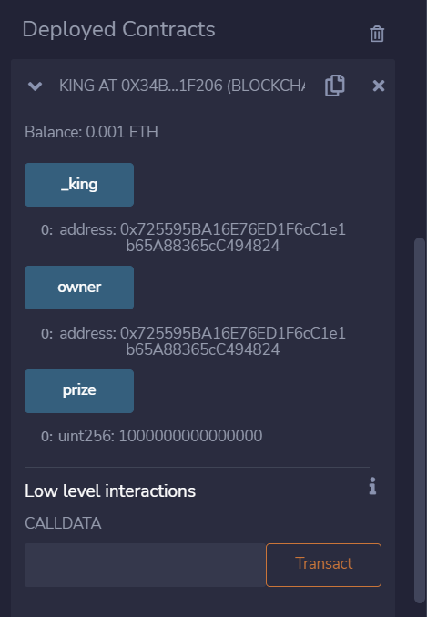
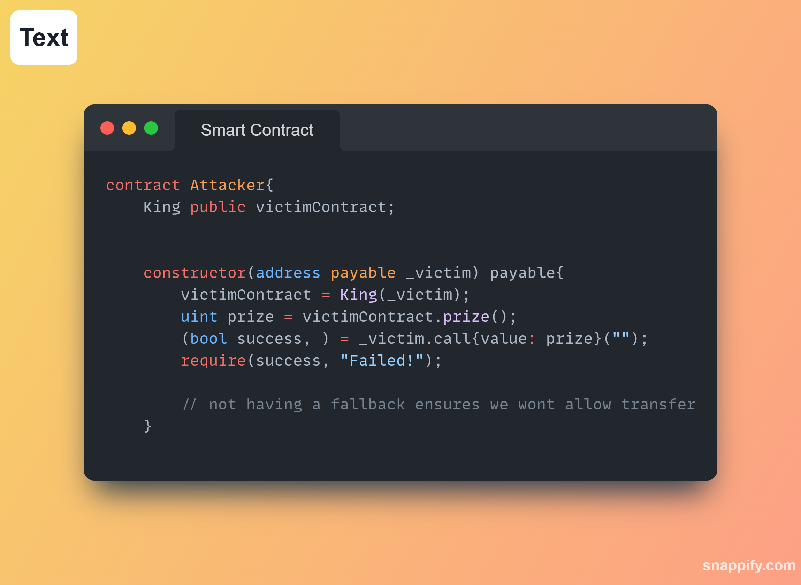
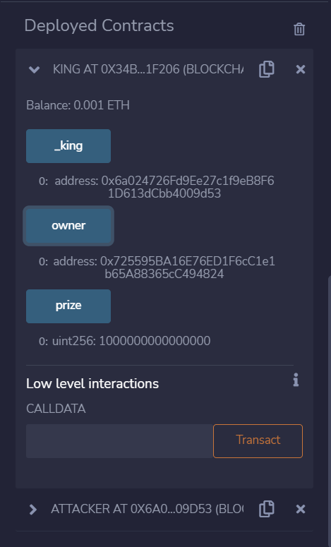

**LEVEL 09: KING**

**TASK AT HAND**

**MATERIALS FOR REFERENCE**

Splitting the fallback function
We realised that the dual-purpose of the function confused developers, which could lead to potential security problems. For example, a developer typically implements a fallback function, expecting only ether transfers to call it, but it is also called when a function is missing from a contract. And confusingly, as this was expected behaviour, no error was reported. 

Link: https://blog.soliditylang.org/2020/03/26/fallback-receive-split/

`receive() external payable` — for empty calldata (and any value)

`fallback() external payable` — when no other function matches (not even the receive function). Optionally payable.

**receive()**

A contract can now have only one `receive` function, declared with the syntax: `receive() external payable {…}` (without the `function` keyword).

It executes on calls to the contract with no data (`calldata`), e.g. calls made via `send()` or `transfer()`.

The function cannot have arguments, cannot return anything and must have `external` visibility and `payable` state mutability.

**I WILL TRY PLAYING WITH THE `fallback()` FUNCTIONS:**

Current status of the `King` Contract

**OBJECTIVE**

When you submit the instance back to the level, the level is going to reclaim kingship. You will beat the level if you can avoid such a self proclamation.

Deploying the Attacker contract:

THE KING HAS BEEN OVERTHROWN!

