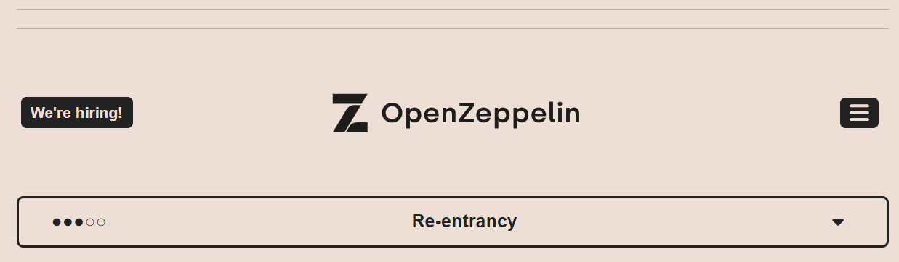
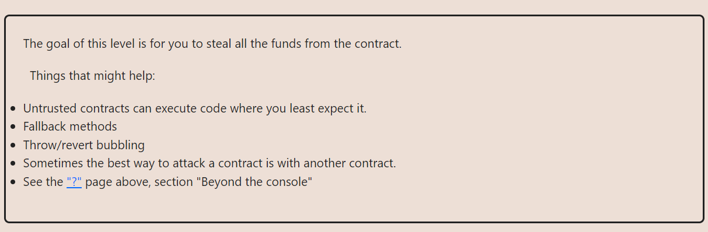

**LEVEL-10: RE-ENTRANCY: HACK**

**TASK AT HAND**

****OBJECTIVE:

To steal all the funds from the contract.
The point of vulnerability in this contract lies in this partof the contract

We will donate some amount to ourselves then call withdraw with the amount being  `1 ETH`

