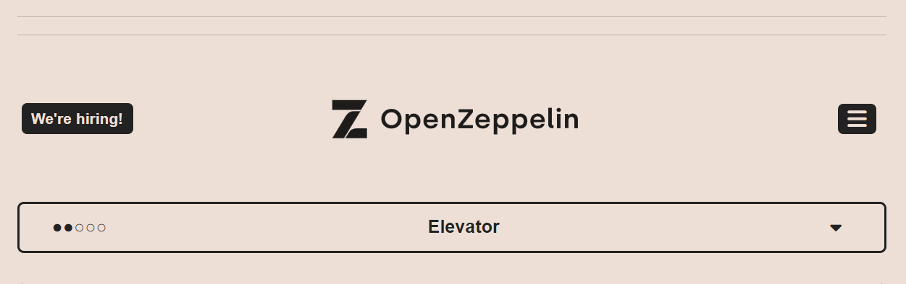
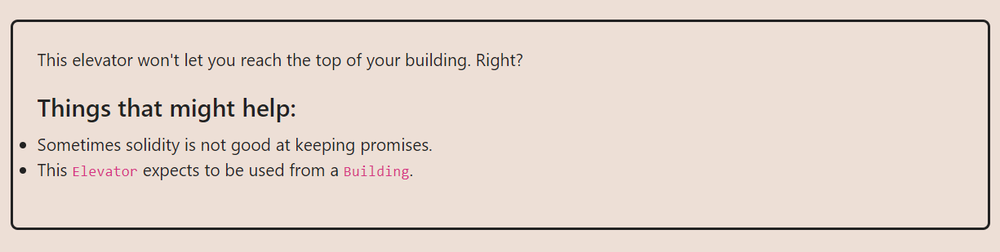
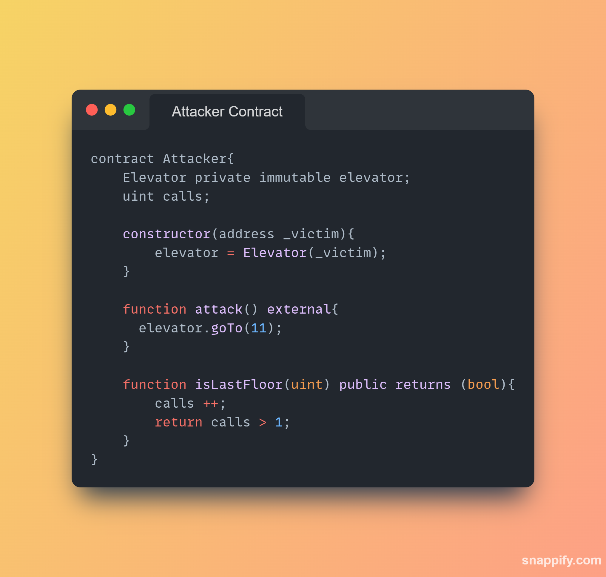

**LEVEL 11: ELEVATOR**

**TASK REQUIREMENTS**
The goal of this challenge is to be able to reach the top floor of the building.

**THE APPROACH I USED**

We will need an `Attacker contract`. we have the `goTo()` that takes a `uint256 _floor`. This function is expected to be called by a smart contract that implements the `Building` interface. 

Here the contract uses the `Elevator` contract to call the `goTo()` which will be used to cheek if we are at the top.

