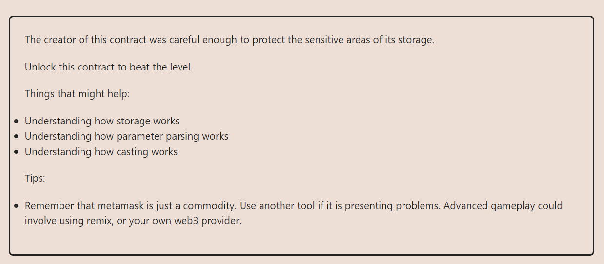

**LEVEL 13: PRIVACY**

**OBJECTIVE**

**THIS ONE WAS TOUGh FOR ME SO I JUST HAD TO REFER TO SOME SOURCES**

[External Source: He explains it better](https://medium.com/coinmonks/ethernaut-privacy-problem-7106562caee2).

The first thing to know is that nothing is stopping us from snooping around a contracts storage variables (even private ones!) very easily, easing something like web3.eth.getStorageAt(/contract.address/ /var index/)

Storage variables are indexed as they’re defined, in other words in this particular case the “locked” variable that is first defined in the contract will be available web3.eth.getStorageAt(/contract.address/, 0)

I have been so busy with my final year thesis

