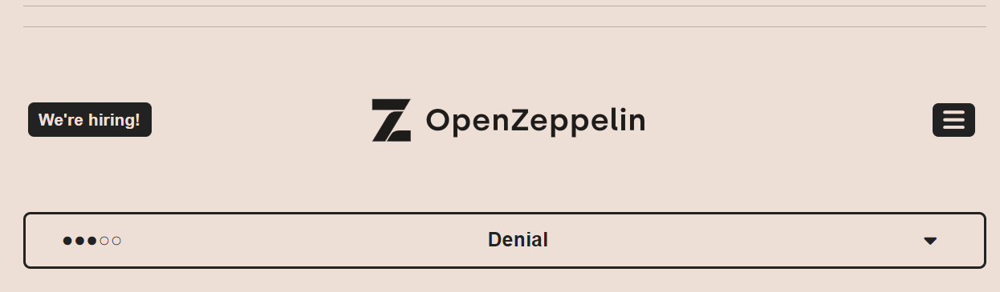
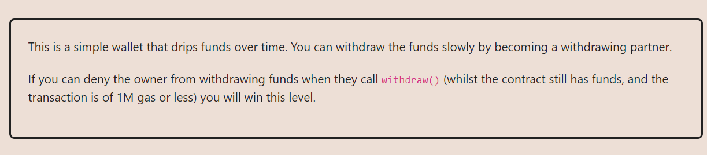
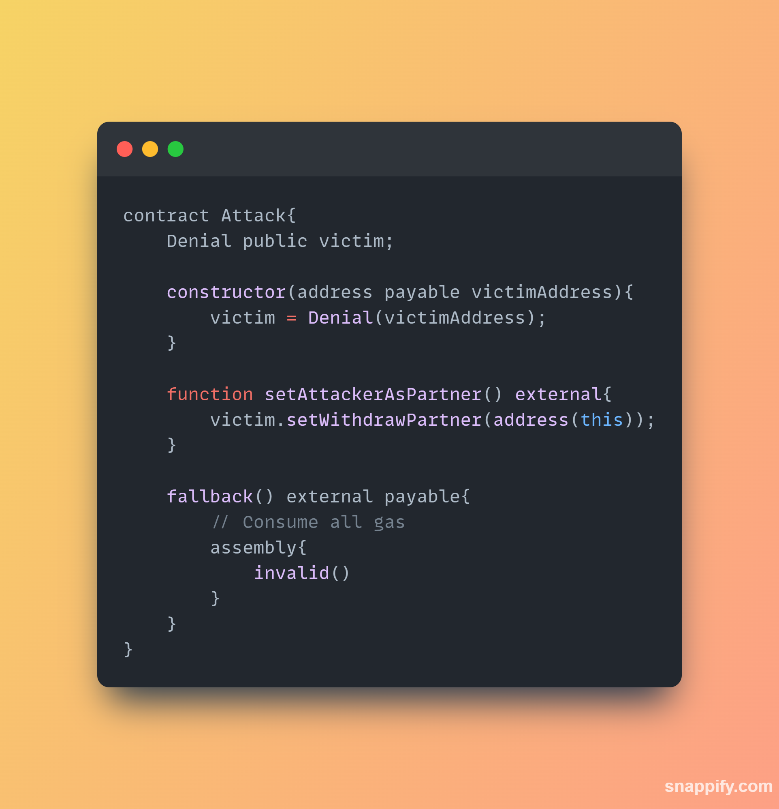
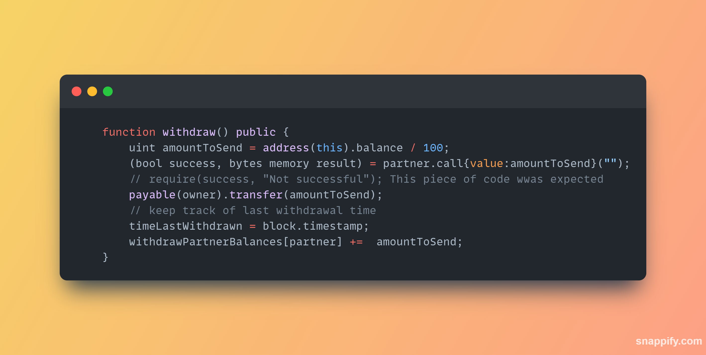

**LEVEL 14: DENIAL**

**TASK REQUIREMENTS**

NOTE:

Note that `0xA9E` is a hexadecimal value, which in decimal is 2718. Therefore, address(0xA9E) represents the Ethereum address whose first 20 bytes are zero, followed by the 20-byte representation of decimal 2718.

It's worth noting that this address is not assigned to any account on the Ethereum network, so sending ether or interacting with this address would not have any effect.

**THE APPROACH I USED**
We need an Attack contract that we will use to deny access to the owner of the contract

We are exploiting this part of the code, 

we want the part of the code where we send money to the owner to be "un-reachable".

